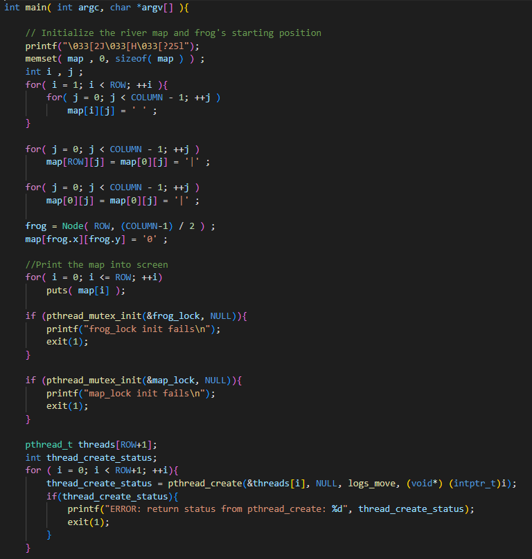
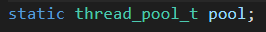

<h1 align="center"> CSC3150 Assignment1 Report </h1>

**Bonus and main task are both implemented. You can refer to them in the directory.**
# Part 0: Student Information
Student ID: 120090575
Student Name: 杜五洲DuWuzhou
# Part 1: Assignment Overview
This assignment includes two tasks: a frog game and bonus.

## 1.1 Frog Game Overview
The first task is the main task, which is a **multithreaded game**. This game is about a frog trying to cross the river. When the game begins, the frog will stand in the middle at bottom bank of river. 
### 1.1.2 **Keymap** 
1. The player can use **key "w"** to move up, **key "s"** to move own, **key "a"** to move left and **key "d"** to move right. Every key pressed down will make frog move **only one step away**.
2. The player can use **key "q"** to quit the game at any time.

### 1.1.3 How to Win or Lose
1. Only if the frog make it to the other bank of river the player wins. 
Between the two banks, there are many moving "woods", where the frog can stand on. Frog can utilize the woods to cross the river and finally make it to the other bank.
2. Player will lose if the frog falls to the river, i.e. the frog doesn't stand on the wood, or the frog hits the border of the screen.

### 1.1.4 Implementation
1. In the main thread, **initialize the map** representing all the contents in the screen. It also creates all the **child threads** in charge of the **woods display**. Then main thread detects whether the game can exit according to the **game status**. If not exiting, detect the **keyboard input** and continue to detect game status. Otherwise, all other child threads will be **joined** to the main thread and print the corresponding result of this game.
2. In the child thread, i.e. the ```logs_move``` function, every thread will generate the initial woods in random place, but in a fixed-length and continuous manner (no separation of different woods and only one wood per line) print only one line in the map. What’s more, each thread will be responsible for **monitoring** whether the frog hits the border or falls to the river in its line, so as to timely **updating the game status**. In addition, if the game continues, the child thread will **update the map** every 0.5s to simulate the woods' and frog's moving.

## 1.2 Bonus
The second task is to implement a **thread pool** with fixed number of threads and with a handler function receiving an ```int``` parameter. 

### 1.2.2 Idea and Design
1. The function ```async_init``` is to initialize the thread pool. The thread pool should include two main attributes **a thread array (or just a number of threads) to handle multiple tasks and a task queue to be handled**. In order to arrange the tasks in the task queue to different threads, a **mutex lock** is needed to prevent duplicate arrangement and some synchronization problems. The child thread should wait until the queue has tasks, so a **thread condition** is needed to wake up the child thread.
2. The function ```async_run``` implements the **task addition of task queue** in the thread pool.
3. The function ```routine_fun``` is the child thread function. It shows how the child thread **firstly sleeps** until a task enters and **wakes the thread to handle the task**.

# Part 2: Implementation Details
## 2.1 Main Task
### 2.1.1 Global Variables and Macros


The frog struct is just to represent which row and column the frog is in. There are actually 11 rows in the frog game, representing 2 banks and 9 lines of woods. There are two **mutex locks** to handle the protection for ```frog``` and ```map``` access and modification. No lock for status since **as long as changing the status all threads will just quit and join the main thread**, according to the game regulations. So, there is **no synchronization problem** for status. Initially, the status is 0, representing the **game continuing status** and no need to exit.

### 2.1.2 Whole Trace


Let's trace the ```main``` function.
Firstly, map should be initialized according to the game starting state, frog in the middle of bottome bank and no woods exist. Then initialize all the **mutex locks** and create all the 11 child threads.

---


After all the initialization, the main thread **begins its routine**. If not exiting the game, the main thread is responsible for **detecting keyboard input**. If typing 'q' or 'Q', it changes the status immediately and quits the game. If typing 'w' or 'W', it **updates** the frog and map. 


If typing 's' or 'S', first **detect** whether frog is on the **border**. If it is, lose game and quit. Otherwise, **update** the map and frog. When typing 'a', 'A', 'd' or 'D' the logic is similar.

---


When getting out of the while loop, it means **it's time to exit the game**. So recycle all child threads and print corresponding message according to the status.
Now let's go through the child thread.

---


**For each line of wood, initialize it in the random place, that is to put the '='s from the random beginning index and the following 14 indexes**. 
Then enter the routine loop.

---


For special cases, when this thread is responsible for the first line or last line, no **losing status** detection. And for the first line, **success detection is needed**. If no status change, **sleep for 0.5s as the update rate period of game display.**


For the even indexed lines, the wood will move right. To update the map, a ```temp``` is maintained to store the next state of this row of map. What's more, the **losing game detection is implemented here by detecting whether the frog is in not in the wood or the frog hits the border.** The ```begin_index``` and ```end_index``` are maintained for this detection. **If no status change, sleep for 0.5s as the update period of game display.**


For the odd indexed lines, the logic is similar to the case when line index is even number, except that the wood will move left.

---


When quiting the loop, clear the screen and thread exit to join the main thread.
## 2.2 Bonus
### 2.2.1 async.h


In ```async.h```, I claim two struct types and two functions.
1. The ```pool_task_t``` represents the **task** in the pool task queue. So, for an **abstract task**, it has a ```task_function``` to handle the task. Of course, the function needs the arguments to implement. Since the function ```async_run(void (*fx)(int), int args)``` returns ```void``` and accepts ```int``` argument, the ```task_function``` also returns void and accepts ```int``` argument. In the task queue, it only needs a pointer to refer to the next task with ```next``` attribute, since in the queue the **head task will be handled first** and **then the next task to be handled**.
2. The ```thread_pool_t``` is the thread pool type. It includes an integer attribute ```max_thread``` representing the **maximum number of threads in this pool to handle tasks**. The ```thread_ids``` attribute is a **pointer to the child created thread from all the child threads.** The ```thread_pool_head``` attribute is a **pointer to the task queue head**, so it is a ```pool_task_t``` type pointer. The attributes ```queue_lock``` and ```queue_ready``` are used for protecting the **shared task queue in the pool** and **waking up one child thread to handle the task**, as mentioned [before](#122-idea-and-design).

### 2.2.2 async.c



The ```async_init``` function innitializes a static variable ```thread_pool_t pool``` and creates all the child threads. The code is really simple and no extra instruction is needed. The ```routine_fun``` is the child thread function, so let's go through this function next.

---


This routine function is the task handler child thread. Every thread is responsible for one task. Thread will acquire the queue **head task** if there is a new task enqued to ```pthread_cond_signal``` **or there is some tasks remaining in the queue already**, which means the thread will not enter the ```while(!pool.thread_pool_head)``` to sleep until the new task enqueues. **After waked up**, the thread will  let head task points to **next task in order to let another thread to handle it**. Then this thread handles this task alone. After handling it, free the memory of this task and continue to wait for next task.

---


```async_run``` adds new task to the task queue end. As long as a new task is coming, **raise the signal to wake up** one child thread to the task queue head. And of course when **modifying the task queue**, **mutex lock should be locked for protection**. This part is simple, no extra instruction is needed.

# Part 3: How to Run My Code and Demo Output
## 3.1 Main Task
Under the ```/Assignment_2_120090575/source``` directory, type ```make``` to start the game.
A demo show is here:


**win the  game**:


**lose the game**:


**quit the game**:


## 3.2 Bonus
1. type ```make``` under the ```Assignment_2_120090575/3150-p2-bonus-main/thread_poll/httpserver``` directory.

2. In this terminal, type ```./httpserver --files files/ --port 8000 --num-threads 10```.

3. In **another** terminal, type ```ab -n 5000 -c 10 http://localhost:8000/```.


This means the program successfully uses 10 threads to handle 5000 http requests within a limited time.

# Part 4: Environment
Distributor ID: Ubuntu Description: Ubuntu 16.04.7 LTS Release: 16.04 Codename: xenial
kernel version: 5.10.146

# Part 5: What Have I Learned from this Assignment
1. About the multithreaded frog game, I firstly tried to achieve the game using a **serial and non-parallel logic**, but only finding that the game had **a little bit latency**, which did not meet the requirement of a game. Nevertheless, by using multi-thread design, the game has **low latency that cannot be sensed by human**. What's more, the logic to achieve the game is much easier. Every thread is **responsible for its own thing**. When the shared resource is accessed or modified, protection is needed.
2. As for the bonus task, first thing I learnt is what a **thread pool** is. It's just about a number of threads created first, then they wait for the task queue to come in and handle this task queue. No thread will exit and be newly created after pool initialized. This will **reduce the cost of creating and destroying thread**.